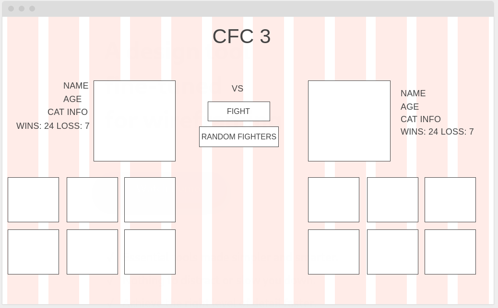
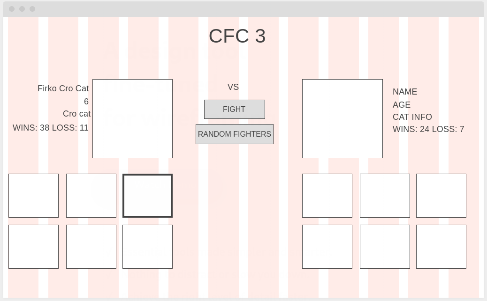
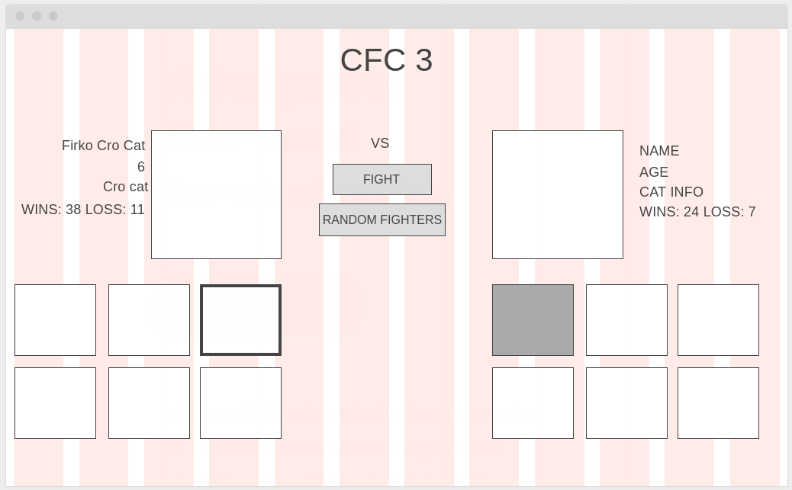
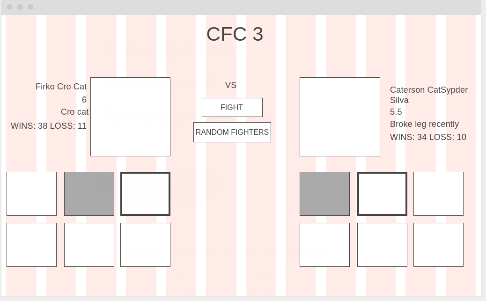
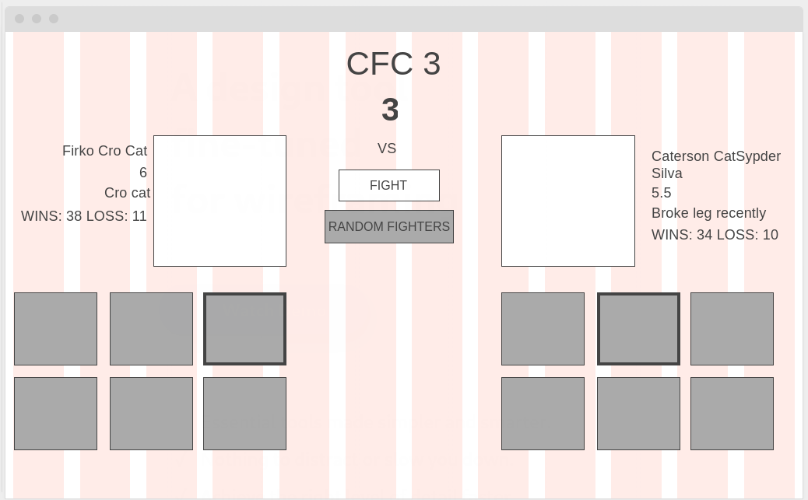
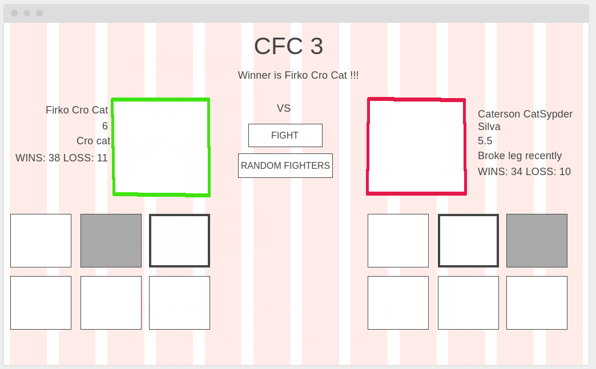
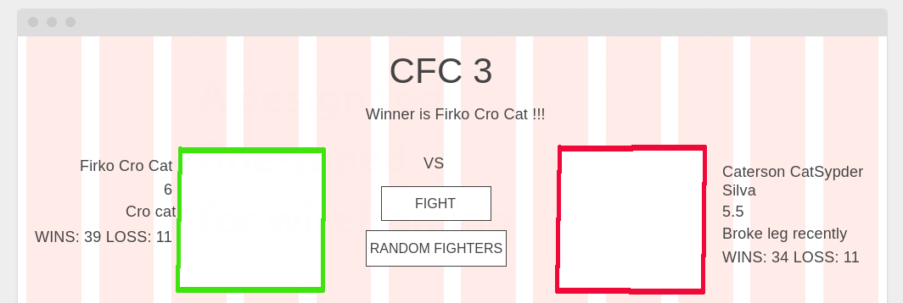

### 1. Zadatak

##### Napomena: Html strukturu zadatka moguće je prilagoditi (u vidu id-eva i klasa, data-atributa) ali temeljna struktura zadatka mora ostati nepromijenjena (izbornici, gumbovi, selektora boraca, poruka itd..)

Bobi i Rudi nakon tvoje pomoći dobili su promaknuće i sad su senior developeri. U firmu je došao novi developer Nikola koji je  bačen u vatru. Od svog projekt managera Ivana dobio je raspisan zadatak i smjernice da kreira interface za novu browser igricu. Nikoli na prvu se zadatak nije činio težak te ga je olako shvatio, svaki dan je igrao nogotenis na krovu firme s ostalim developerima i samo je odgađao posao. U četvrtak ga je Ivan pitao koji je status zadatka, a Nikola je slagao i rekao da će sutra biti gotov.

Nikola je došao kući i vidio kako se precijenio i vidio da nije baš tako. Uhvatila ga je panika - kreirao je potrebne HTML elemente prema specifikacijama ali tu je stao jer ne zna tako dobro JavaScript - bivši kolega Luka koji je dao otkaz uvijek mu je pomagao oko JavaScripta. Pomozi Nikoli riješit zadatak da ne dobije opomenu od Šefa jer PM Ivan će ga cinkati ako ne riješi zadatak na vrijeme.

Specifikacije zadatka su sljedeće:

* Potrebno je kreirati sučelje prema navedenom wireframe-u (Nikola je to napravio) 
  

* Kada korisnik klikne na mačku unutar daljnjeg selektora mačaka - potrebno je učitati podatke o mački i sliku u glavni izbornik. Ako korisnik izabere mačku iz lijevog selektora potrebno je učitati informacije u lijevi izbornik i obratno. Podatci o svakoj pojedinoj mački nalaze se unutar data atributa u JSON formi. Gumb "Fight" mora biti onemogućen i ne može se aktivirati sve dok korisnik izabere borca s obje strane. "Random Fighter" gumb generira nasumično borca s lijeve i desne strane. "Random Fighter" ne smije generirati nasumično istog borca s lijeve i desne strane. Potrebno je doraditi funkcionalnost ako se to desi - generiraj ponovno nasumično borce.
   

* Ako korisnik ne odabere random fighter gumb, potrebno je napraviti funkcionalnost kada korisnik odabere borca s lijeve strane, onemogućava biranje istog tog borca s desne strane. 
  

* Kada korisnik izabere borca s obje strane - omogućen mu je gumb "Fight"
  

* Klikom na gumb "Fight" započinje borba. U tome trenutku potrebno je onemogućiti sve gumb-ove i selektore boraca dok ne završi borba kako korisnik u toku borbe ne bi ponovno izabrao nekog borca. Potrebno je implementirati odbrojavanje od 3 sekunde. Kada odbrojavanje završi simulacija mora dinamički dodati poruku i napisati tko je pobjednik (*boostrap je učitan u head-u*). Potrebno je postaviti zeleni obrub na pobjednikovu sliku unutar glavnog izbornika, a borcu koji je izgubio crvenu. Nakon što borba završi korisnik može ponovo selektirati borce, odabrati random borce i započeti borbu.
 
 

* Glavna funkcionalnost zadatka je algoritam simulacije koji glasi:
  * Kada se klikne na gumb fight svakom borcu računa se postotak pobjeda 
    * Primjer Firko Cro cat -> 38+11 = 49 -> postotak pobjede: 38/49 -> 0,775510204082 ~ 77.551%
    * Primjer Caterson CatSypderSilva - 34+10 = 44 -> postotak pobjede: 34/44 -> 0,772727272727 ~ 77.272%
  * Borac koji ima veći postotak pobjede ima blagu prednost u simulaciji nad borcem koji ima manji postotak u sljedećem sistemu:
    * Ako razlika između postotaka pobjeda je manja od 10% između Borca s većim postotkom pobjeda u odnosu na drugog borca -> Borac ima 10% prednost u simulaciji nad borcem koji ima manji postotak
    * Ako razlika između postotaka pobjeda je veća od 10% između Borca s većim postotkom pobjeda u odnosu na drugog borca -> Borac ima 20% prednost u simulaciji nad borcem koji ima manji postotak
  * Primjer: Razlika postotka između Catersona i Firka iznosi 0,27% -> što znači da je ona manja od 10% i time Firko ima 10% prednost u simulaciji da će pobijediti
  * *(POMOĆ: Prilikom implementiranja simulacije jedan od načina kako dodijeliti nekom prednost je da se odredi interval u kombinaciji s metodom Math.random() i Math.round() -> ako se radi o nasumičnom odabiru 50 50 koristio bi se interval vrijednosti od [0,0.49] za prvog, dok za drugog [0.5,0.99]; U navedenom primjeru Firko pobjeđuje u simulaciji ako se generira nasumični broj u intervalu [0,0.59] dok u intervalu [0.6,0.99] Caterson pobjeđuje)*

* Nakon borbe potrebno je ažurirati borčev data-atribut. Borcu koji je pobijedio treba povećati broj pobjeda, dok protivniku koji je izgubio treba dodati poraz. Nove vrijednosti moraju se uzeti u obzir prilikom pokretanja nove simulacije borbe. Potrebno je obratiti pozornost da se borac nalazi na obje strane selektora.
 

*  (POMOĆ: jedan od kombinacija ažuriranja data atributa je pomoću metoda JSON.parse() ,JSON.stringify() kao i metode .setAttribute() za ponovno generiranje cijelog data-atributa unutar DOM-a.
